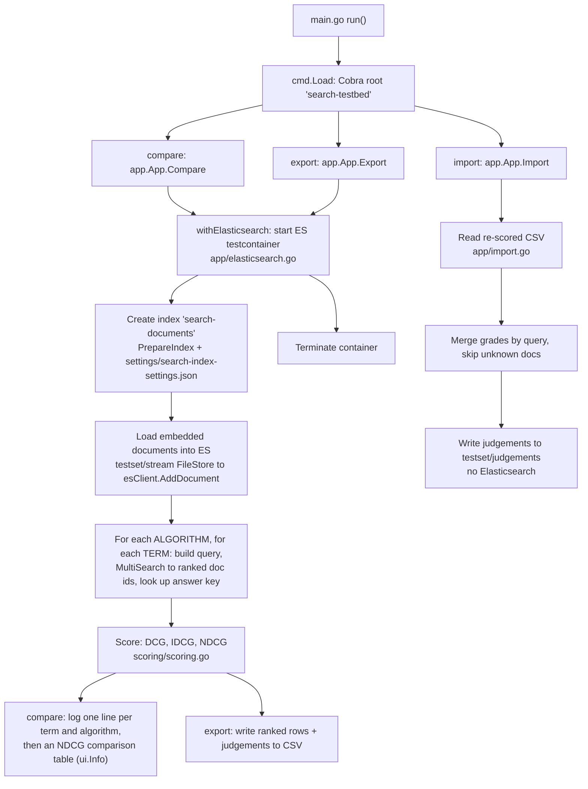

# Architecture & Onboarding Guide

A guide for anyone reading this codebase, or reviewing a merge request against it, for the first time. It explains **what the project is trying to achieve** and **how the pieces fit together**. Every section points at a real file and line (e.g. [`app/evaluate.go:279`](app/evaluate.go#L279)) so you can jump straight to the code.

## Contents

1. [What this project is for](#1-what-this-project-is-for)
2. [The big picture (end-to-end flow)](#2-the-big-picture-end-to-end-flow)
3. [The test data model: documents, terms, judgements](#3-the-test-data-model-documents-terms-judgements)
4. [Loading the data: the `stream` interface](#4-loading-the-data-the-stream-interface)
5. [Producing production-representative queries: the `algorithm` package](#5-producing-production-representative-queries-the-algorithm-package)
6. [Talking to Elasticsearch: testcontainers and index settings](#6-talking-to-elasticsearch-testcontainers-and-index-settings)
7. [The commands: how you run it](#7-the-commands-how-you-run-it)
8. [Scoring: DCG, IDCG, NDCG](#8-scoring-dcg-idcg-ndcg)
9. [Terminology](#9-terminology)
10. [Running and verifying it](#10-running-and-verifying-it)

---

## 1. What this project is for

When we change how ONS search ranks results, we need to answer one question objectively: **did the ranking get better or worse?** "Better" is easy to argue about and hard to measure, so this project turns it into a number.

The idea:

- We keep a set of **search terms** (e.g. `cpi latest`).
- For each term, a human writes an **answer key**: a list of pages and how relevant each one is, graded **0 to 4** (0 = irrelevant, 4 = a perfect match).
- We run the search algorithm, look at the order it returns pages in, and compare that order against the answer key.

The score we use is **NDCG** (Normalised Discounted Cumulative Gain). It rewards putting the most relevant pages near the top and gives less credit when good pages appear further down, which matches how real users behave. It is normalised so that **1.0 means the best possible ordering for this term**.

That's the whole project: **load a known set of documents into a real Elasticsearch, run a search algorithm against known terms, and score the ranking it produces against human relevance judgements.**

---

## 2. The big picture (end-to-end flow)

The tool exposes **three sibling commands**:

- **`compare`**: run the evaluation with one or more algorithms and log a score line per term and algorithm, then print a table comparing each algorithm's NDCG.
- **`export`**: run the same evaluation with the baseline algorithm, then write the ranked results and their current judgements to a CSV.
- **`import`**: read a re-scored CSV back and merge the new grades into the judgements. This one does not use Elasticsearch.

`compare` and `export` share the same core flow (start Elasticsearch, index the documents, query each term, score the ranking); `import` is the reverse, filesystem-only path.



Walking the shared path in code:

1. [`main.go:18`](main.go#L18) `run()` builds the root command via [`cmd.Load`](cmd/root.go#L9) and calls `ExecuteContext(ctx)`, so the context reaches the commands at run time.
2. The root registers three sibling commands, `compare`, `export` and `import` ([`cmd/root.go:30`](cmd/root.go#L30)).
3. [`App.Compare`](app/app.go#L42) and [`App.Export`](app/app.go#L58) both start a throwaway Elasticsearch via [`withElasticsearch`](app/elasticsearch.go#L24) (create the index, load the documents, evaluate every term, then tear the container down); `compare` logs the scores and the comparison table, and `export` writes the ranked rows to CSV. [`App.Import`](app/import.go#L48) does not touch Elasticsearch.
4. Per algorithm and term, [`App.evaluateTerms`](app/evaluate.go#L91) builds a query, runs it, and scores the result, logging one line like:

   ```
   term "cpi latest" (cpi-latest) [baseline]: DCG=4.0000 IDCG=5.7619 NDCG=0.6942
   ```

   `compare` then prints an NDCG table, one row per term and one column per algorithm, ending in each algorithm's mean NDCG. Because the algorithm-independent work (listing the documents, waiting for the index to become searchable, reading the terms and their answer keys) is loaded once into an `evaluationContext`, adding an algorithm costs only its searches.

The rest of this document explains each stage in that flow.

---

## 3. The test data model: documents, terms, judgements

This is the foundation everything else builds on. It lives in [`testset/`](testset/) and is split into **three sibling directories, one JSON file per item, where the filename is the item's id**. (There is a fuller spec in [`testset/README.md`](testset/README.md).)

```
testset/
  documents/    # the pages that could be returned by a search
  terms/        # the searches we evaluate
  judgements/   # the answer key: how relevant each document is for a term
```

**Documents** mirror the production search-index schema (`EsModel`), so the test data looks like the real index. `id` is a harness-only field (the filename / join key); production identifies pages by `uri`. Example ([`testset/documents/cpi-latest.json`](testset/documents/cpi-latest.json), trimmed):

```json
{
  "id": "cpi-latest",
  "type": "bulletin",
  "uri": "/economy/inflationandpriceindices/bulletins/consumerpriceinflation/april2026",
  "title": "Consumer price inflation, UK: April 2026",
  "keywords": ["cpi", "cpih", "inflation", "consumer price inflation"],
  "summary": "Price indices, percentage changes and weights ...",
  "topics": ["economy", "inflationandpriceindices"],
  "published": true
}
```

**Terms** are the searches ([`testset/terms/cpi-latest.json`](testset/terms/cpi-latest.json)):

```json
{ "id": "cpi-latest", "query": "cpi latest", "description": "Most recent CPI bulletin" }
```

**Judgements** are one term's answer key ([`testset/judgements/cpi-latest.json`](testset/judgements/cpi-latest.json)):

```json
{
  "query_id": "cpi-latest",
  "judgements": [
    { "doc_id": "cpi-latest", "relevance": 4 },
    { "doc_id": "accountancy-services-timeseries", "relevance": 1 },
    { "doc_id": "growth-dataset", "relevance": 2 }
  ]
}
```

**How they relate.** A judgement is the _link_ between a term and a document, and the relevance grade lives on that link (it's a property of the pair, not of either side alone). The join keys are:

- `judgements[*].doc_id` maps to `documents[*].id`
- a judgement file's `query_id` maps to `terms[*].id` (and the judgement's **filename** is also the term id, so the code can fetch a term's answer key directly by id, see [`relevanceForTerm`](app/evaluate.go#L256)).

Two things to note:

- The set is **sparse**: we only record judged pairs. Any returned document **not** in a term's answer key is treated as **relevance 0**.
- Filenames must equal ids, ids must be unique, and every `doc_id`/`query_id` must resolve. These are the validation rules in [`testset/README.md`](testset/README.md).

---

## 4. Loading the data: the `stream` interface

The test data has to get from those JSON files into memory (and into Elasticsearch). That's the job of the small generic loading layer in [`testset/stream/`](testset/stream/), the "interface for loading" you'll see referenced in tickets.

It's a storage-neutral interface built from three generic pieces:

- [`Reader[T]`](testset/stream/reader.go#L7): `Get(ctx, id)` and `List(ctx)`.
- [`Writer[T]`](testset/stream/writer.go#L6): `Put(ctx, id, item)`.
- [`Stream[T]`](testset/stream/stream.go#L10): just `Reader[T]` plus `Writer[T]` combined.

The concrete implementation is [`FileStore[T]`](testset/stream/filestore.go#L71), which reads items from a filesystem and (optionally) writes them back: [`Get`](testset/stream/filestore.go#L94) reads one file, [`List`](testset/stream/filestore.go#L115) reads a whole directory.

A key design choice: test data is **not** decoded into typed structs at load time. Each item is kept as its raw JSON body, keyed by filename ([`Item{Name, Body}`](testset/stream/items.go#L34)). The [`itemCodec`](testset/stream/items.go#L46) validates the JSON and minifies it (via [`algorithm.MinifyJSON`](algorithm/minify.go#L9)) so the document body indexed into Elasticsearch is exactly the fixture on disk. Decoding into a `term` or `judgement` struct happens later, only where needed (in [`app/evaluate.go`](app/evaluate.go#L24)).

The data itself is **compiled into the binary** with `//go:embed` ([`testset/fixtures.go:9`](testset/fixtures.go#L9)), so the tool needs no external data files at runtime. The three stores are created by [`NewDocumentStore`](testset/stream/items.go#L75), [`NewJudgementStore`](testset/stream/items.go#L92) and [`NewTermStore`](testset/stream/items.go#L109).

The read path is the compiled-in snapshot, but the same stores also expose the `Put` writer. The [`import` command](app/import.go#L48) uses it to persist re-scored judgements back to the on-disk `testset/judgements/`. Because reads come from the embedded snapshot, a written judgement is only picked up on the next build (this is the seam where a real persistence layer will later slot in).

---

## 5. Producing production-representative queries: the `algorithm` package

To measure the _real_ search experience, the tool must send Elasticsearch the _real_ production queries, not a toy `match` query. That's what [`algorithm/`](algorithm/) provides: a way to build a full Elasticsearch request for a named algorithm (e.g. `baseline`).

**The interfaces** ([`algorithm/interface.go`](algorithm/interface.go)):

- [`SearchRequestBuilder`](algorithm/interface.go#L10): `BuildRequest(ctx, *SearchParameters) ([]client.Search, error)` turns search parameters into one or more Elasticsearch searches.
- [`SearchRequestRegistry`](algorithm/interface.go#L17): `GetRequestBuilder(algo)` hands you the builder for a named algorithm; unknown algorithms [fall back to baseline](algorithm/request.go#L79). The evaluation instead uses [`RequestRegistry.BuilderFor`](algorithm/request.go#L68), which errors on an unregistered algorithm, so results are never attributed to an algorithm that did not produce them.

**The templates.** A query is assembled from a tree of Go `text/template` fragments under [`algorithm/templates/`](algorithm/templates/): 34 `.tmpl` files split into top-level queries (`queries/termQuery.tmpl`, `queries/counts/*.tmpl`) and reusable partials (`partials/matchers`, `partials/filters`, `partials/scoring/boosts`, `partials/sort`, and so on). They are embedded at [`algorithm/templates.go:10`](algorithm/templates.go#L10), rendered by [`BuildQuery`](algorithm/query.go#L48), and minified into compact json for the Elasticsearch multi-search API.

The available algorithm names are defined in [`algorithm/option.go`](algorithm/option.go) (`baseline`, `unweighted`) and enumerated by [`AllSearchAlgorithms`](algorithm/option.go#L23), which is the single source of truth behind the `compare --algorithms` flag, its help text and its name validation ([`ParseSearchAlgorithms`](algorithm/option.go#L60)). The parameters a caller supplies (term, index, from, size, and so on) are [`SearchParameters`](algorithm/option.go#L125). The baseline builder, which performs one term search plus count aggregations, is [`NewSearchRequestBuilderBaseline`](algorithm/request.go#L114).

> Because the queries are JSON produced by templates, there's a dedicated linter, `dis-json-template-linter`, wired into [`make lint-json-templates`](Makefile#L105) that checks the templates still produce valid JSON. Golden "this template should render to exactly this query" fixtures live under `algorithm/testdata/queries/`.

---

## 6. Talking to Elasticsearch: testcontainers and index settings

The tool scores against a **real** Elasticsearch, but you don't need one installed. On each run it spins up a throwaway instance in Docker using [testcontainers](https://testcontainers.com/) and tears it down afterwards. This lives in [`elasticsearch/container.go`](elasticsearch/container.go):

- [`NewElasticSearchContainer`](elasticsearch/container.go#L48) starts a single-node ES container (it first checks Docker is up via [`isDockerRunning`](elasticsearch/container.go#L27)).
- [`GetURL`](elasticsearch/container.go#L82) returns the dynamic `http://host:port` for that container.
- [`Terminate`](elasticsearch/container.go#L97) stops it at the end of the run.

The actual Elasticsearch client is the shared ONS library `dp-elasticsearch/v4`, constructed against the container URL in [`app/elasticsearch.go:51`](app/elasticsearch.go#L51).

Before documents are loaded, the index is created with the correct mappings/analysers by [`PrepareIndex`](elasticsearch/setup.go#L14), which reads the embedded settings from [`settings.GetSearchIndexSettings()`](settings/settings.go#L10) (the JSON lives in [`settings/search-index-settings.json`](settings/search-index-settings.json)). The index name is the hardcoded constant `"search-documents"` ([`app/elasticsearch.go:16`](app/elasticsearch.go#L16)).

Documents are then indexed one at a time in [`loadStore`](app/elasticsearch.go#L109) via `esClient.AddDocument`: each item's filename becomes its ES document id and its raw body becomes the document.

---

## 7. The commands: how you run it

The CLI is built with [Cobra](https://cobra.dev/), and the business logic lives in a separate [`app`](app/) package so the commands stay thin. The `cmd` package only wires Cobra; [`app.App`](app/app.go#L23) owns the operations, and [`app.New`](app/app.go#L30) builds it from the embedded stores (documents, terms, judgements). Only documents get indexed into Elasticsearch; terms and judgements are used for evaluation.

- [`cmd.Load`](cmd/root.go#L9) builds the root command `search-testbed` with a single persistent flag, `--verbose`/`-v` ([`cmd/root.go:19`](cmd/root.go#L19)).
- [`getSubCommands`](cmd/root.go#L30) wires **three sibling commands**, all registered directly on the root: `compare`, `export` and `import`.

The three commands:

- **`compare`** ([`cmd/compare.go`](cmd/compare.go#L17)) calls [`App.Compare`](app/app.go#L42): start a throwaway Elasticsearch, index the documents, evaluate every term with each selected algorithm, log one score line per term and algorithm, then print the NDCG comparison table. This is the core evaluation flow described in section 2. Its `--algorithms`/`-a` flag selects which algorithms to run (all of them by default); the names are resolved in `RunE` **before** `App.Compare` is called, so a mistyped name fails without paying for a container start.
- **`export`** ([`cmd/export.go`](cmd/export.go#L11)) calls [`App.Export`](app/app.go#L58): the same evaluation, then write each ranked result and its current relevance judgement to a CSV via [`writeEvaluationsCSV`](app/export.go#L54). It requires an output path (`-o`/`--output`).
- **`import`** ([`cmd/import.go`](cmd/import.go#L11)) calls [`App.Import`](app/import.go#L48): read a re-scored CSV (the export format) and merge the grades back into the judgement store. It requires an input path (`-i`/`--input`). Import needs **no** Elasticsearch: it merges each row into the query's existing judgements, treats a grade of 0 as unjudged (removing that entry to keep the answer keys sparse), and skips any `doc_id` that is not in the document corpus with a warning, so no dangling references are written.

`compare` and `export` share the Elasticsearch orchestration in [`withElasticsearch`](app/elasticsearch.go#L24) and the evaluation loop in [`App.evaluateTerms`](app/evaluate.go#L91). `export` passes the baseline algorithm alone, because its CSV has no algorithm column. `import` is a separate, filesystem-only path in [`app/import.go`](app/import.go).

---

## 8. Scoring: DCG, IDCG, NDCG

This is where a ranking becomes a number. The maths is in one small, dependency-free file, [`scoring/scoring.go`](scoring/scoring.go), and is verified by [`scoring/scoring_test.go`](scoring/scoring_test.go).

**DCG (Discounted Cumulative Gain)**, [`CalculateDCG`](scoring/scoring.go#L32), walks the ranked list and adds up each item's relevance, _discounted_ by how far down it appears:

```
DCG = Σ  relevance_i / log2(position + 1)      (positions are 1-based)
```

The discount `log2(position + 1)` grows as you go down the list ([`calculateDiscountFactor`](scoring/scoring.go#L58)), so a relevant page at position 1 is worth its full grade, but the same page at position 5 is worth much less. That's the "good results near the top matter more" behaviour.

**IDCG (Ideal DCG)**, [`CalculateIDCG`](scoring/scoring.go#L45), is the best DCG you could possibly get for this term: it sorts the relevance grades into descending order and computes DCG of that ideal ordering.

**NDCG**, [`CalculateNDCG`](scoring/scoring.go#L11), is simply `DCG / IDCG`, giving a 0 to 1 score where 1.0 is a perfect ranking.

**How the harness actually scores a term** ([`scoreRanking`](app/evaluate.go#L279)):

1. Take the returned document ids in rank order and map each to its grade from the answer key; a returned id that wasn't judged defaults to **0** ([`app/evaluate.go:282`](app/evaluate.go#L282)).
2. `dcg = CalculateDCG(actual)` over the full returned ranking ([`app/evaluate.go:290`](app/evaluate.go#L290)).
3. `idcg = CalculateIDCG(judged)` over all judged grades for the term ([`app/evaluate.go:291`](app/evaluate.go#L291)).
4. `ndcg = dcg / idcg`, computed inline ([`app/evaluate.go:293`](app/evaluate.go#L293)).

> Why it computes `dcg/idcg` by hand instead of calling `CalculateNDCG`: `CalculateNDCG` requires the actual and ideal slices to be the **same length**, but here the "actual" list (what was returned) and the "judged" list (everything with a grade) can differ in length, so the division is done directly.

### Worked example

Take the term `growth-figures`. Its answer key ([`testset/judgements/growth-figures.json`](testset/judgements/growth-figures.json)) is:

| Document                          | Relevance |
| --------------------------------- | --------- |
| `growth-dataset`                  | 4         |
| `cpi-latest`                      | 2         |
| `accountancy-services-timeseries` | 1         |

Suppose the baseline algorithm returns them in this order (**illustrative**, the real order comes from Elasticsearch at runtime): `[cpi-latest, growth-dataset, accountancy-services-timeseries]`.

The grades in returned order are `[2, 4, 1]`, so:

```
DCG  = 2/log2(2) + 4/log2(3) + 1/log2(4)
     = 2/1       + 4/1.585   + 1/2
     = 2 + 2.5237 + 0.5      = 5.0237
```

The ideal order is the grades sorted high to low, `[4, 2, 1]`:

```
IDCG = 4/log2(2) + 2/log2(3) + 1/log2(4)
     = 4 + 1.2619 + 0.5       = 5.7619

NDCG = DCG / IDCG = 5.0237 / 5.7619 = 0.872
```

**0.872** means the ranking is good but not perfect: `growth-dataset` (grade 4) should have been first. Swapping the top two to `[growth-dataset, cpi-latest, …]` would make DCG equal IDCG and give **NDCG = 1.0**. (And remember: any returned page that isn't in the answer key counts as relevance 0, dragging the score down.)

---

## 9. Terminology

**Terminology.** You will see both "queries" and "terms" for the same thing. The concept was renamed from _query_ to _term_, but the JSON and Go still use the older field names `query_id` / `Query` (see the [`term`](app/evaluate.go#L24) and [`judgement`](app/evaluate.go#L31) structs). Read "term" and "query" as synonyms.

---

## 10. Running and verifying it

**Run a command** (see the [README](README.md) for full usage and prerequisites). `compare` and `export` need Docker running for the Elasticsearch testcontainer; `import` does not:

```sh
go run . compare                 # evaluate every term with every algorithm and compare their NDCG
go run . compare -a baseline     # or restrict it to selected algorithms
go run . export -o results.csv   # also write the results to CSV
go run . import -i results.csv   # merge a re-scored CSV back into the judgements

# or use the Makefile to run compare:
make compare
```

You'll get one line per term reporting `DCG`, `IDCG` and `NDCG` ([`app/evaluate.go:128`](app/evaluate.go#L128)).

**Test:**

```sh
go test ./...            # full suite (integration tests start a real ES container)
go test ./... -short     # skips the container-backed integration tests
```

The scoring maths in particular is covered by [`scoring/scoring_test.go`](scoring/scoring_test.go), which asserts the worked-example-style values (e.g. `DCG([1]) == 1.0`, and that IDCG leaves its input slice untouched).
